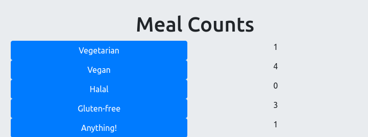
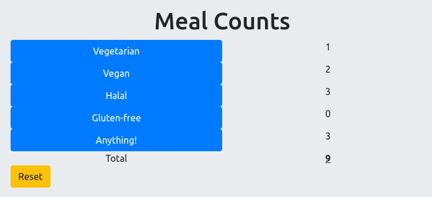

# Challenge: Lunch Order Counters

## Challenge Overview

You must make a React app which assists you in taking an order for lunch for a large group, by providing multiple counters for different options (vegetarian, halal, vegan, etc).

### Example Screenshot

## What you need to know before starting:

This challenge is suitable if you have successfully completed the homework of CYF React Week 2.

# Try to figure the rest out by yourself

If you want a harder challenge, don't read the rest of this document but try to build the app by yourself.

# Suggested approach

Here's one approach you might take to building this app.

## Task: Create a new React app

Create a new empty React app for this challenge.

The tool can take a while to run, so continue with the next task while it's running...

## Task: Design your layout _on paper_

Design your layout on paper. Keep it very simple - this is a React challenge, not a CSS challenge.

Use a layout that will be ok on a phone (but don't do responsive design).

Keep this drawing around for reference later.

## Task: Convert your layout to JSX (HTML)

Make a prototype which just shows two or three example counters. _Don't_ worry about the JSON yet.

You can do this all within your `App.js`, or you can immediately build some React Component(s).

## Task: Make a component to represent a counter

Make a single counter which has a title given to it and which increments its count when clicked.

## Task: Use this component repeatedly

Reuse your component for each meal option you want to present.

## Advanced challenges: total, and reset

See more detail below...

### Advanced Challenge: Add a reset button

Add a reset button which will set all counts back to zero.

### Advanced Challenge: Add a total

Add a live total of meals selected.

## Advanced Challenge: Host your app

Host your app and prove it works by viewing it on your phone!

It is recommended that you use Netlify to host. (Some other options are Heroku, github pages, or codesandbox.io, or glitch.com, ...)
