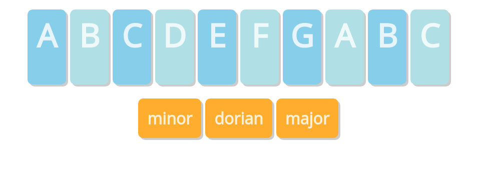

# Challenge: "Musical Keyboard" with React and Tones.js

## Challenge Overview

You must make a React app which presents a very simple musical keyboard made of buttons. When a button is pressed, the correct musical note sounds.

### Try a live demo:

[Try this live demo!](https://cyf-tones-react.netlify.com/)

### Example Screenshot

## What you need to know before starting:

This challenge is suitable if you have successfully completed the homework of CYF React Week 1.

You _will_ need to know...

- how to create a React app
- how to create a component in React
- how to pass props
- how to populate components from an array
- how to handle events (button clicks)

In addition, you'll learn...

- How to install a library (in this case, tones.js)
- How to make synthesised sound with the tones.js library. This is one of many ways to make sound in a web app.

# Task: Install the "tones.js" library

- If you haven't created your app yet, use `create-react-app` to create the skeleton of the app.
- Check the app works, by running `npm start` from your app's root directory.
- **Use the following command to install the tones library:
  `npm install -s tones`**
- Check the app STILL works, with `npm start`

### Optional - Advanced:

- Look in `package.json`, and compare it with `package.json` for another React app you have. What do you notice?

# Look at the first tones.js example

- Look at the first example from the [tones.js documentation](https://tonejs.github.io/).
- Load and experiment with [this JSFiddle of that example](https://jsfiddle.net/enz0/f0b2u7ct/)
- Try to understand the two lines of js code in the example.

# Try to finish the rest by yourself

If you want a harder challenge, don't read the rest of this document but instead try to build the app by yourself.

If you want hints, then you will find some below.

# Suggested approach

Here's one approach you might take to building this app.

## Task: Create a new React app

Create a new empty React app for this challenge.

The tool can take a while to run, so continue with the next task while it's running...

## Task: Design your layout _on paper_

Design your layout on paper. Keep it very simple - this is a React challenge, not a CSS challenge.

Use a layout that will be ok on a phone (but _don't_ spend time on responsive design).

Keep this drawing around for reference later.

## Task: Convert your layout to JSX (HTML)

Convert the drawing to HTML (on codepen or elsewhere) and check the buttons appear correctly.
_DON'T_ add any CSS or extra markup to make it look good just now. That will only make it more difficult for you to think about your app during development.

## Task: Convert your HTML to JSX within your React app

Now make a React component to represent your musical keyboard. It should generate the HTML for your buttons. You can do this all first within your `App.js`, or you can build a React Component.

## Task: Get the buttons working

- Write code which calls `console.log` when the "musical keyboard" buttons are clicked.

## Task: Get the audio working

- Add code which uses tones.js to make sounds when buttons are pressed. Keep it _very_ simple.

If you need a hint, [use the first example in the docs, here.](https://tonejs.github.io/)

## Task: Host your app

Host your app and prove it works by viewing it on your phone!

We recommend you use Netlify. [Instructions are here](https://gist.github.com/nbogie/bf58a391fab6884f77a6adec66047181).

(You can instead use Heroku to host, or github pages, or codesandbox.io, or glitch.com...)

## End of basic challenge!

Congratulations, you've finished the basics!

- Send the URL of your hosted app to your team on Slack.
- Make sure you can access it and play with it on a smartphone!
- Celebrate!

## Advanced Challenge: make it change scale.

If you know a little about music scales (or don't mind reading), you might want to make your keyboard play only notes from a certain scale.

Here's the names of the notes in a C pentatonic scale, for example: `C4 D4 E4 G4 A4 C5 D5 E5 G5 A5 C6`

- Change your app to use minor scale, a blues or bebop scale, or another scale.

## Advanced Challenge: support multiple scales

- Add to the interface so that the user can choose what scale they want.

## Advanced Challenge: make it look good

- Now is a good time to make it look good with CSS, colour, typography, images, and creativity. Or maybe you could ask someone to collaborate with you and do those aspects.

## Further resources

- https://musiclab.chromeexperiments.com/Oscillators/
