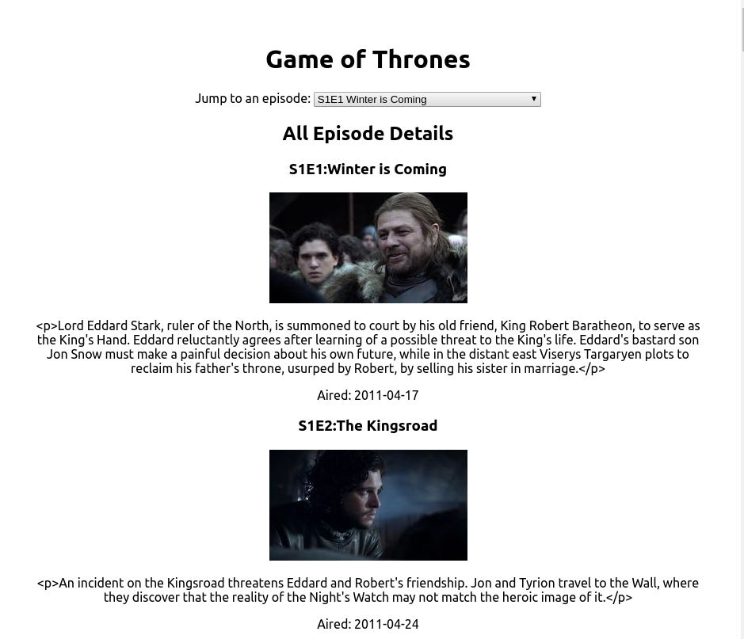

# Challenge: TV Show Episode List

## Challenge Overview

You must make a React app which shows all of the episode summaries of a tv show such as "Game Of Thrones", in one long list.

### Example Screenshot

## What you need to know before starting: 

This challenge is suitable if you have successfully completed the homework of CYF React Week 1.

You *will* need to know...

* how to create a react app
* how to load a static json file
* how to create a component in react
* how to pass props
* how to populate components from an array

You DON'T need to know about: 
* state
* fetching JSON from an API

## Task: Download and save a JSON file

Your app should read the information *locally* from a static JSON file.  Download one of the following JSON files and save it.

* [Breaking Bad](http://api.tvmaze.com/shows/169/episodes)
* [Game of Thrones](http://api.tvmaze.com/shows/82/episodes)
* [Lost](http://api.tvmaze.com/shows/123/episodes)
* [Sherlock](http://api.tvmaze.com/shows/335/episodes)
* [Star Trek TNG](http://api.tvmaze.com/shows/491/episodes)
* [The Daily Show](http://api.tvmaze.com/shows/3928/episodes)
* [The Simpsons](http://api.tvmaze.com/shows/83/episodes)
* [The Sopranos](http://api.tvmaze.com/shows/527/episodes)
* [The Walking Dead](http://api.tvmaze.com/shows/73/episodes)
* [The Wire](http://www.tvmaze.com/shows/179/the-wire)
* [The X-Files](http://api.tvmaze.com/shows/430/episodes)
* [True Blood](http://api.tvmaze.com/shows/22/episodes)

Save it in your app in a new directory `src/data/`.  E.g. `src/data/sherlock.json`

# Try to figure the rest out by yourself

If you want a harder challenge, don't read the rest of this document but try to build the app by yourself.

# Suggested approach 

Here's one approach you might take to building this app.

## Task: Investigate the JSON

Look at the JSON.
Ask yourself the following questions and more - these will help you when you come to use the JSON in your app:

* Does it contain an array or an object, at the top level?
    * If you think it contains an object at top level, what are the properties of the object?
    * If you think it contains an array at top level, how many elements are there in that array?

* What properties will you need from each episode?
    * What are their names?
    * Are they nested within other properties?

## Task: Create a new React app

Create a new empty React app for this challenge.

The tool can take a while to run, so continue with the next task while it's running...

## Task: Design your layout *on paper*

Design your layout on paper.  Keep it very simple - this is a React challenge, not a CSS challenge.

Use a layout that will be ok on a phone (but don't do responsive design).

Keep this drawing around for reference later.  

## Task: Convert your layout to JSX (HTML)

Make a prototype which just shows detail from one or two example episodes.  *Don't* worry about the JSON yet.  

You can do this all within your `App.js`, or you can immediately build some React Component(s).

## Task: Read in the JSON

Make your app load the JSON that you previously saved in a local file.  Extract the first episode and use it to populate an `Episode` component.

## Task: Make the whole list of episodes

Loop over the JSON to make a whole list of `Episode` components.  If your app crashes at this point, *DO NOT* edit the JSON - instead, debug your code.

## Advanced Challenge: make an episode selector

Modify your app to show only one episode, which your user can choose using a `select` input.

Make the selector that lists the episode numbers (E1S1) and titles, and allows you to choose one.

When you choose one from the selector, have the single shown episode update accordingly.

## Advanced Challenge: Host your app

Host your app and prove it works by viewing it on your phone!

You can use Heroku to host, or github pages, or codesandbox.io, or glitch.com

## Advanced Challenge: download the json live from the API

We have not covered how to do this in class yet.

Change your React app so that instead of using static data in a local file, it gets the data from the API just before it shows the page.

Add the ability to change which *show* is being presented.  E.g. change from "Game of Thrones" to "Star Trek".
